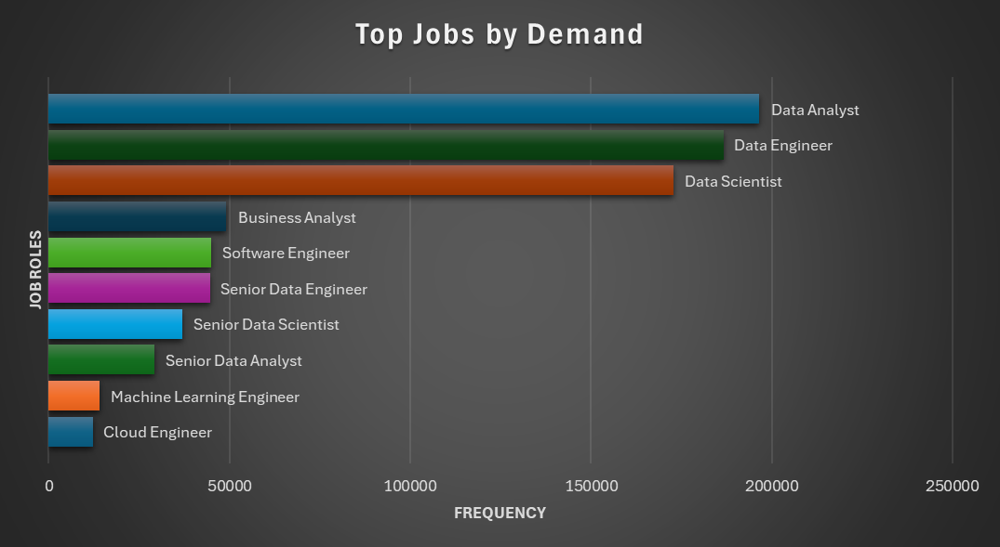
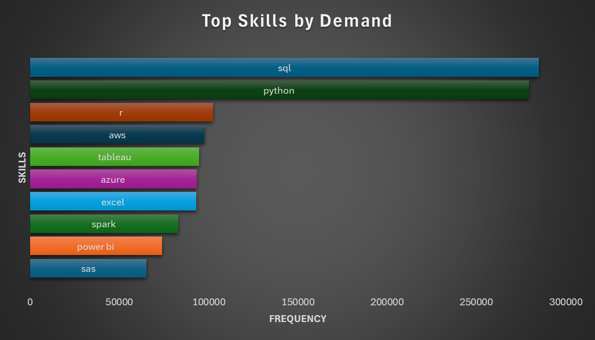
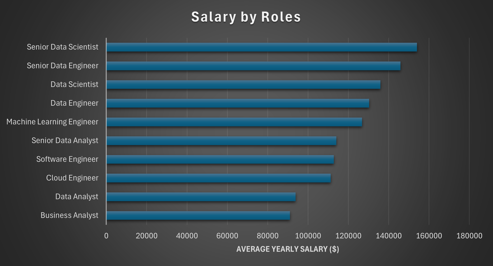

# Introduction

Diving into the job market, This project focuses on Data and Technology roles providing insights on 💲 top paying jobs, skills in demand, 📈 Job market trends as well as how specific requirements impact your job search. 

The dataset for this project includes job postings from 2023 to 2024, analyzing job market trends following the layoff spree by major companies.

SQL queries are located here: [Job Market EDA Folder](/Job_Market_EDA/)

# Background
This project was inspired by the goal of navigating the job market more efficiently, aiming to identify high-paying, in-demand skills and simplify the job search process for everyone.

Data for this project comes from [Job Postings](https://www.kaggle.com/datasets/lukebarousse/data-analyst-job-postings-google-search/versions/642/data). An older version of this dataset was used to pinpoint the job market trends in the 2023-2024 timeframe.

### The questions I wanted to answer through my analysis were:

1. What are the roles and skills with the highest demand in the job Market?

2. What are the top paying roles and the companies that offer them?

3. Which skills are associated with higher salaries?

4. What is the percentage of remote jobs being offered and comparing the average salary of remote and on-site jobs?

5. How does salary compare between jobs that require a degree and those that don't?

6. What are the countries with the most job opportunities and the highest average salaries offered?

# Tools
For my deep dive into the job market, I harnessed the power of several key tools:

- **Excel:** For easier cleaning of data, standardization and data visualization post-processing.
- **SQL:** Enables quick querying of large datasets and insightful data extraction.
- **MySQL:** DBMS of choice, ideal for handling large quantities of data.
- **Git & GitHub:** Enables efficient collaboration, code management and project tracking.

# The Analysis
The dataset was cleaned with Excel and loaded into MySQL. The queries in this section tackle different questions leading to meaningful insights:

### 1. Job Trends and Demand
Finding the job roles with the highest demand in the market as well as skills required for these roles.

```sql
-- Finding the job titles with the highest demand in the job market

SELECT job_title_short, COUNT(job_id) AS job_title_count
FROM job_postings_info
GROUP BY job_title_short
ORDER BY job_title_count DESC;

-- Finding the top skills that are required for these roles

WITH top_job_titles AS (
    SELECT job_title_short
    FROM job_postings_info
    GROUP BY job_title_short
    ORDER BY COUNT(job_id) DESC
    LIMIT 3
),
top_job_title_id AS 
(
    SELECT job_id, job_title_short
    FROM job_postings_info
    WHERE job_title_short IN 
    (
        SELECT job_title_short
        FROM top_job_titles
    )
)
SELECT job_title_short, skills, COUNT(skills_info.skill_id) skill_count
FROM top_job_title_id
JOIN skills_job_info ON top_job_title_id.job_id = skills_job_info.job_id
JOiN skills_info ON skills_job_info.skill_id = skills_info.skill_id
GROUP BY job_title_short, skills
ORDER BY job_title_short, skill_count DESC;
```
Key insights into the most in-demand jobs and skills of 2023:

- **Data Dominance:** Data Analysts, Data Engineers, and Data Scientists lead the job market in demand, while specialized roles like Machine Learning Engineers and Cloud Engineers see comparatively lower demand, indicating a stronger preference for general data and software engineering skills.

- **Top Skills in Demand:** Python and SQL lead with the highest number of job postings.

- **AI and Big Data Focus:** Machine Learning and Spark are highly valued in the job market showing the market shift towards these technologies.

- **Visualization Tools on the Rise:** Tableau and Power BI indicate the demand for data visualization and business intelligence.


*Bar graph visualizing the most in-demand jobs roles based on job postings*


*Bar graph visualizing the most in-demand skills for the top job roles based on job postings*


### 2. Salary Analysis
Identifying the top paying job roles based on average yearly salary and the companies that offer the highest salary for each role.

```sql
-- To identify the top paying job roles based on average salary

SELECT job_title_short, ROUND(AvG(salary_year_avg)) avg_salary
FROM job_postings_info
GROUP BY job_title_short
ORDER BY avg_salary DESC;


-- Finding the company that offers the highest salary for each job role


WITH salary_table AS 
(
    SELECT job_id, job_title_short, company_id, salary_year_avg,
        Rank() OVER (PARTITION BY job_title_short ORDER BY salary_year_avg DESC) AS salary_rank
    FROM job_postings_info
),
ranked_salary AS 
(
    SELECT company_id, job_title_short, salary_year_avg, salary_rank
    FROM salary_table
    WHERE salary_rank = 1
    ORDER BY salary_year_avg DESC
)
SELECT company_info.name, job_title_short, salary_year_avg
FROM ranked_salary
JOIN company_info ON ranked_salary.company_id = company_info.company_id
ORDER BY salary_year_avg DESC;
```
Key Trends spotted from the Analysis

- **Salary Progression:** Salaries increase significantly with seniority and specialization, with senior data roles earning up to an average of $154,050.

- **Data and AI Demand:** Data Scientists ($135,929) and Machine Learning Engineers ($126,786) command high average salaries, reflecting strong demand for AI expertise.

- **Cloud Specialization:** Cloud Engineers ($111,268) are well-compensated, emphasizing the growing reliance on cloud infrastructure.

- **Growth with Seniority:** Transitioning from mid-level to senior roles results in substantial average salary jumps, often exceeding $20,000.

- **Career Growth Opportunities:** Analysts can significantly increase their earnings by upskilling in data engineering, machine learning, or cloud technologies.



*Bar graph visualizing the job roles that pay the most*

| Company                                     | Job_role                  | Yearly Salary ($) |
|---------------------------------------------|---------------------------|-----------------|
| East River Electric Power Cooperative, Inc. | Data Scientist            | 960000          |
| MSP Staffing  LTD                           | Senior Data Scientist     | 890000          |
| Mantys                                      | Data Analyst              | 650000          |
| Durlston Partners                           | Data Engineer             | 525000          |
| The Walt Disney Company                     | Senior Data Analyst       | 425000          |
| Winston Fox                                 | Senior Data Engineer      | 425000          |
| Roblox                                      | Business Analyst          | 387460          |
| Bayer                                       | Software Engineer         | 375000          |
| Storm5                                      | Machine Learning Engineer | 325000          |
| Harnham                                     | Machine Learning Engineer | 325000          |
| Технологическая компания                    | Cloud Engineer            | 280000          |

*Table Showing the companies with highest pay for each Job role*

### 3. Skills Analysis

Identifying the skills associated with higher salaries

```sql
-- Finding the skills associated with higher salaries

WITH skill_salary AS
(
    SELECT job_postings_info.job_id, skill_id, salary_year_avg,
            AVG(salary_year_avg) OVER (PARTITION BY skill_id) skill_salary_avg
    FROM job_postings_info
    JOIN skills_job_info ON job_postings_info.job_id = skills_job_info.job_id
    WHERE salary_year_avg IS NOT NULL
)
SELECT DISTINCT skills, ROUND(skill_salary_avg)as salary
FROM skills_info
JOIN skill_salary ON skills_info.skill_id = skill_salary.skill_id
ORDER BY salary DESC;
```
Trends in the data of the Highest Paying Skills
- **Top-Paying Skills:** Debian ($196,500), RingCentral ($182,500), and Mongo ($170,715) are the highest-paying skills, highlighting demand for niche and specialized expertise.

- **Emerging Technologies:** Blockchain (Solidity - $153,640), AI/ML frameworks (PyTorch - $144,470), and Big Data tools (Cassandra - $154,124) are lucrative and reflect modern tech trends.

- **Programming Languages:** High-paying languages include Haskell ($155,758), Scala ($145,120), Rust ($139,349), and Python-related libraries like Pandas ($137,518).

- **Cloud & DevOps Demand:** Skills like AWS ($136,481), Kubernetes ($137,949), and Terraform ($133,161) underscore the importance of cloud computing and infrastructure automation.

- **Lower-Paying Skills:** Foundational tools such as Excel ($99,751) and PowerPoint ($99,160) have lower salaries compared to specialized technical skills.


*Bar graph visualizing the highest paying skills in 2023*

### 4. Remote Work Trends
Finding the no of remote jobs as opposed to on-site jobs posted in 2023 and comparing the salaries offered
```sql
-- Calculating the percentage of remote job postings

SELECT COUNT(*) total_jobs,
        (SELECT COUNT(job_id) 
         FROM job_postings_info
         WHERE job_work_from_home = 1) AS remote_job_count,
        (SELECT COUNT(job_id) 
         FROM job_postings_info
         WHERE job_work_from_home = 1) * 100 / COUNT(*) AS remote_job_percentage
FROM job_postings_info;

-- Comparing the average salary for remote and onsite jobs

SELECT
ROUND(AVG(CASE WHEN job_work_from_home = 1 THEN salary_year_avg ELSE NULL END)) AS remote_salary,
ROUND(AVG(CASE WHEN job_work_from_home = 0 THEN salary_year_avg ELSE NULL END)) AS onsite_salary
FROM job_postings_info;
```
A breakdown of results based on Remote job offers:
- **Remote Work Scarcity:** Only 8.8% of jobs are remote, while 91.2% remain in-office or on-site, reflecting a strong preference for traditional work setups.

- **Remote Work Opportunities:** While remote jobs are fewer, they still represent a substantial number (69,606 positions), suggesting opportunities for professionals seeking flexible work setups.

- **Potential for Growth:** The relatively small proportion of remote jobs highlights a potential area for growth as more organizations adopt hybrid or fully remote models.

- **Remote vs. Onsite Pay:** Remote jobs offer a slightly higher average salary ($131,779) compared to onsite jobs ($121,784), indicating a premium for remote work arrangements potentially due to higher demand or the need to attract top talent across geographical boundaries.


*Pie Chart visualizing the remote and onsite job spread*

| remote_salary($) | onsite_salary ($) |
|------------------|-------------------|
| 131779           | 121784            |

*Table showing the average Remote and Onsite salaries*

### 5. Education and Jobs

Analyzing the differences in salaries between jobs requiring a degree and those without degree requirements.

```sql
-- Comparing the average salary of job postings that require a degree vs those that don't

SELECT
ROUND(AVG(CASE WHEN job_no_degree_mention = 1 THEN salary_year_avg ELSE NULL END)) AS salary_norequirements,
ROUND(AVG(CASE WHEN job_no_degree_mention = 0 THEN salary_year_avg ELSE NULL END)) AS salary_requirements
FROM job_postings_info;
```

| salary_norequirements ($) | salary_requirements ($) |
|-----------------------|---------------------|
| 113645                |125026              |

*Salary Comparison: Non=Degree vs Degree Jobs*

Inference from the above analysis: 
- **Higher Salary for Jobs with Requirements:** Jobs that require a degree or specific qualifications offer an average salary of $125,026, which is approximately 10% higher than jobs without requirements ($113,645). This indicates that educational or skill-based qualifications tend to lead to higher-paying roles.

### 6. Geographical Insights

Analyzing the trends in Job Markets based on Country. Filtering out countries with lower than 10 job posts for standardization.

```sql
-- Finding the locations that offer the highest average salary as well as the most job opportunities

SELECT job_country, 
       ROUND(AVG(salary_year_avg)) AS avg_salary,
       COUNT(job_country) AS job_count
FROM job_postings_info
WHERE job_country IS NOT NULL 
AND salary_year_avg IS NOT NULL
GROUP BY job_country
HAVING COUNT(job_country) > 10
ORDER BY avg_salary DESC;
```

Insights derived from job analysis based on location: 
- **US Tops in Jobs, Not Pay:** The United States has the highest number of jobs (15,813) with an average salary of $126,018, suggesting a robust job market but not the highest pay.

- **Sudan's High Average:** Sudan shows a surprisingly high average salary ($135,038) with 1,612 jobs, which may indicate a specialized job market.

- **India Stands Strong:** The decent amount of job opportunities (580) and a high average salary ($113,768) shows that the job market in India is still moving without much hinderance amidst the layoffs.

- **Lower Salary Regions:** Countries like the Philippines ($83,814), Puerto Rico ($83,013), Taiwan ($82,576), and Turkey ($78,870) have some of the lowest average salaries among those listed, reflecting regional economic disparities.


*Bar graph visualizing the countries offering the most Job opportunities*


*Bar Graph visualizing the countries that pay the highest avg salary*


# Technical Skills Overview

**📊Excel:** Performed data cleaning using functions like TRIM and created visual representations with Pivot Charts and Pivot Tables.

**🛢️SQL:** Conducted in-depth analysis using techniques such as GROUP BY, Window Functions, Subqueries, CTEs, and Joins to derive actionable insights.

# Conclusions

### Insights
From the analysis, several general insights emerged:
1. **Roles and Skills in Demand:** Python and SQL are the most sought-after skills, with high demand for Data Analysts, Data Scientists, and Machine Learning Engineers.

2. **Top Paying Roles and Companies:** Data Scientists ($135,929) and Machine Learning Engineers ($126,786) earn competitive salaries, with niche skills like Debian ($196,500) and RingCentral ($182,500) being valued for these roles.

3. **Skills Associated with Higher Salaries:** Specialized skills in AI/ML (PyTorch - $144,470), Big Data (Cassandra - $154,124), and Cloud (AWS - $136,481) yield higher salaries.

4. **Remote Jobs and Salary Comparison:** Only 8.8% of jobs are remote, but they offer a higher average salary ($131,779) compared to on-site roles ($121,784).
  
5. **Degree Advantage:** Jobs requiring a degree or specific qualifications offer around 10% higher salaries on average, emphasizing the financial benefits of educational or skill-based qualifications.

6. **Countries with Most Opportunities and Salaries:** The US leads with the highest number of jobs (15,813) at an average salary of $126,018, while Sudan reports a surprisingly high average salary of $135,038.

7. **Optimal Skills to Learn:** Python, SQL, Machine Learning, Spark, AWS, and Tableau are highly valued for career growth and salary advancement.

### Closing Thoughts

This project provided valuable insights into the current data job market, highlighting the most in-demand skills, top-paying roles, and regional salary differences. By leveraging SQL for in-depth data analysis and using Excel for effective data visualization, I was able to uncover trends that can guide both job seekers and organizations.

From understanding the importance of Python, SQL, and cloud technologies to identifying the premium salaries associated with specialized skills, this analysis serves as a resource for making informed career decisions. Additionally, the comparison of remote and on-site job opportunities sheds light on evolving work preferences and compensation trends.

Through this project, I strengthened my skills in data extraction, analysis, and visualization — demonstrating the power of data-driven insights in navigating today’s competitive job market.
